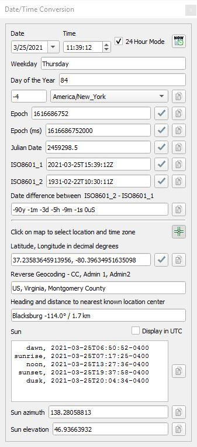
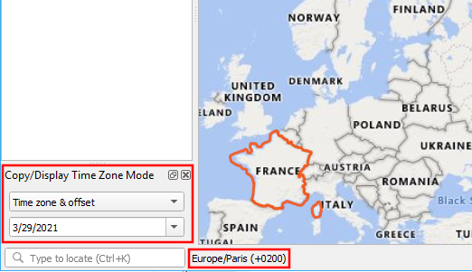
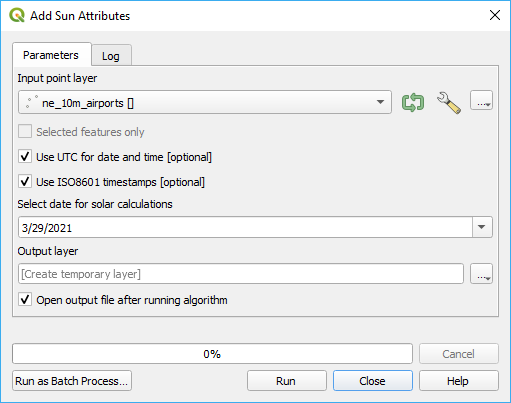
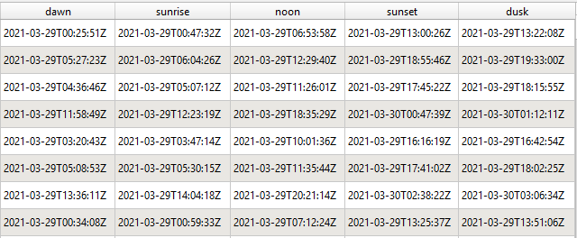
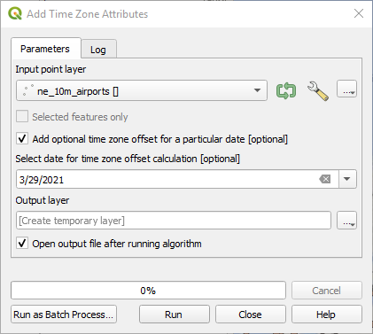
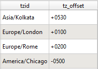

# Date/Time Tools Plugin

The QGIS Date/Time Tools plugin provides tools to manipulate date, time, time zones, and times of the sun.

## Installation

This plugin requires 3 additional libraries not provided by QGIS. These can be installed by opening up your OSGeo4W Shell from the QGIS menu and typing the command "**pip install timezonefinder astral reverse_geocoder**" or whatever method you use to install Python libraries.

You do not need to be a system administrator to be able to install these libraries.

## Date/Time Tools Overview

These are the tools provided by Date/Time Tools.

*  ***Date/Time Conversion*** - This is a dialog box that displays different formats of a date and time, computes time differences, and displays various sun times such as dawn, sunrise, noon, sunset, and dusk.
*  ***Time Zone Capture*** - With this tool selected, as the mouse moves across the canvas the time zone and/or time offset is displayed in the lower left info box and the time zone is highlighted on the canvas.
*  ***Add Sun Attributes*** - This is a processing tool that for a point layer and a given date, calculates the time of dawn, sunrise, noon, sunset, and dusk and adds them to the attribute table and creates a new layer.
*  ***Add Time Zone Attributes*** - From a point layer, this processing algorithm adds the time zone each point is in as well as the time zone offset for a particular date if selected. 

##  Date/Time Conversions
The Date/Time conversion panel provides date and time conversions between various formats and time zones. Formats include ISO8601 dates and times, Julian dates, and Unix timestamps (Epoch). It displays the weekday and day of the year. It calculates the difference between two different dates. It provides the ability to select a time zone from a list or by clicking on the map. When a coordinate is specified, a reverse geocoder finds the closest location to the point with a heading and distance. Sun times of dawn, sunrise, noon, sunset, and dusk are calculated for the specified date.

*  ***Update with system time***. Clicking on this button updates the date and time to the current system date, time, and time zone.
*  ***Select location and time zone***. Clicking on this button allows the user to click anywhere on the QGIS canvas to snapshot the latitude, longitude, and time zone at that location.
*  ***Accept changes***. Clicking on this button accepts the changes in the text box next to it and updates the entire dialog box.
*  ***Copy to clipboard***. Clicking on this button copies the associated text onto the clipboard.

A second date and time can be entered for ISO8601_2 in order to calculate the difference between it and ISO8601_1. Once a latitude and longitude has been specified, information about solar times of dawn, sunrise, noon, sunset, and dusk will be displayed as well as the sun azimuth/direction and elevation from the horizon.

##  Time Zone Capture
With this tool selected, as the mouse moves across the canvas, the time zone and/or time offset is display in the lower left info box and the time zone is highlighted on the canvas.

When this tool is activated a settings dialog box is displayed. Here you can choose whether to displays just the time zone, time zone offset, or both the time zone and it's offset. The time zone offset requires a date to be specified. Clicking on the map copies this information to the clipboard.

##  Add Sun Attributes
This is a point layer processing tool that for a given date, calculates the time of dawn, sunrise, noon, sunset, and dusk and adds them to the attribute table and creates a new layer. 

The input layer is a point layer, a date must be specified, and the results are saved to an output layer. This shows what is added to the attribute table.

##  Add Time Zone Attributes

From a point layer, this processing algorithm adds the time zone the point is in as well as the time zone offset if a date is give and **Add option time zone offset for a particular date** is selected. These are the attribute fields that are added.

